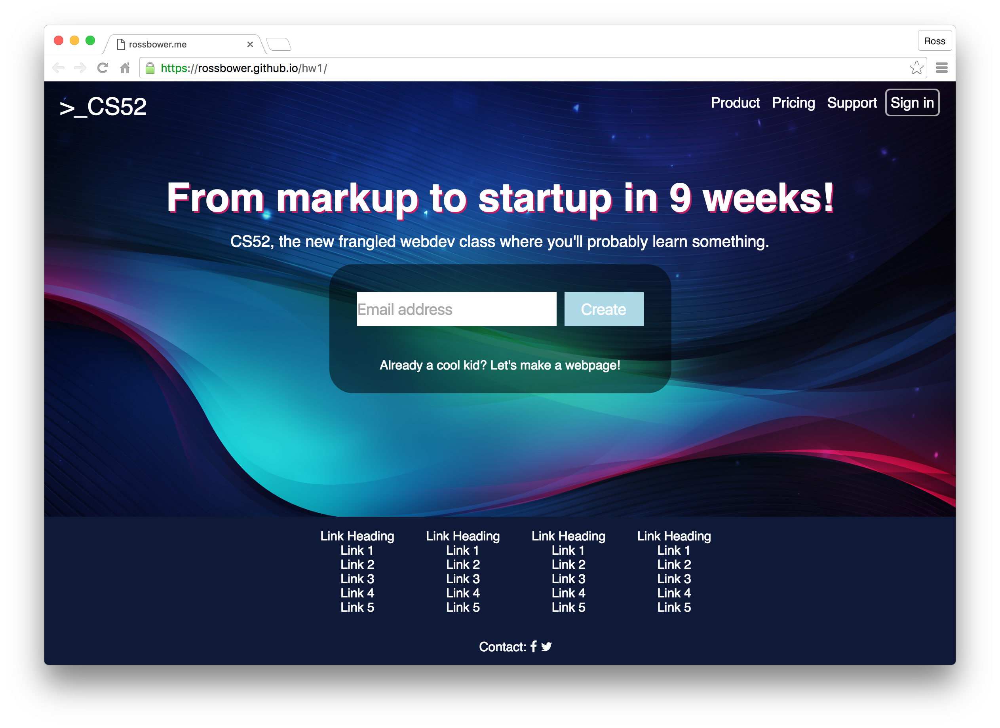
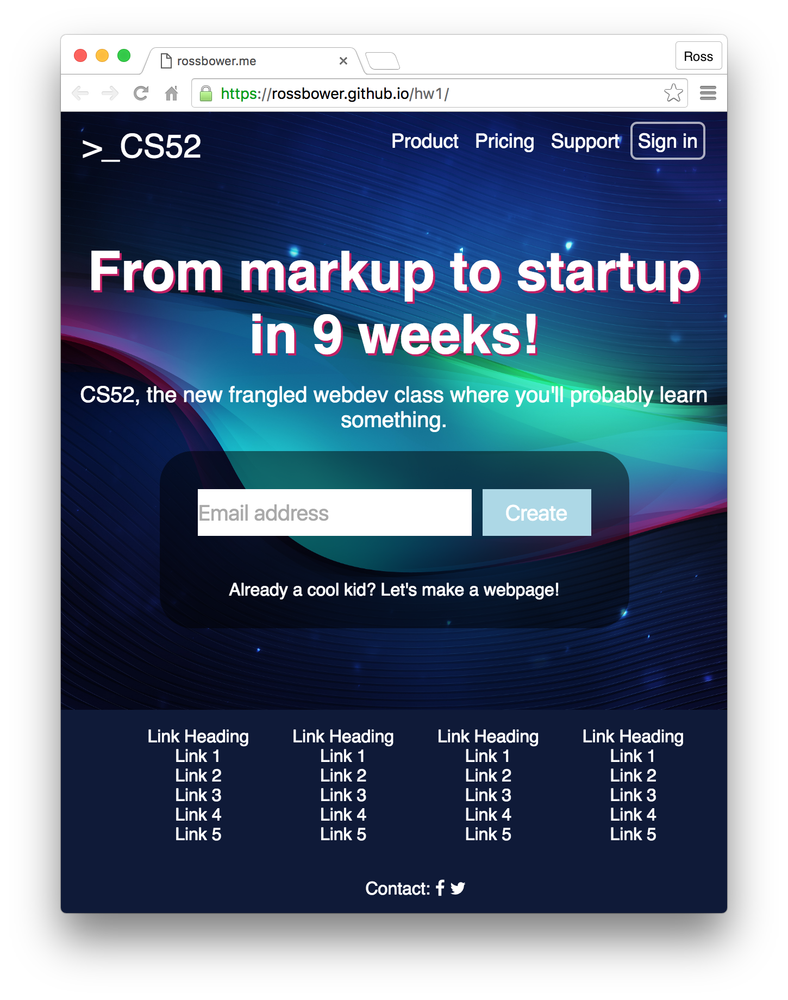
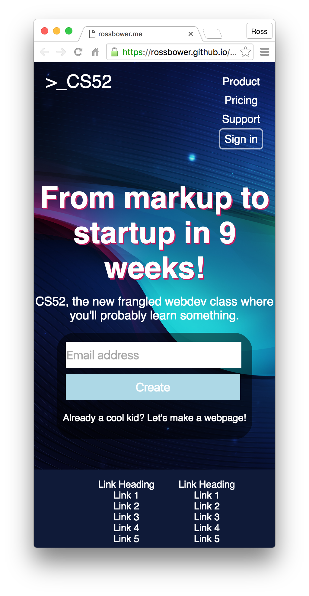

Ross Bower

HTML and CSS were used to implement this website. I used many flexboxes to assist in the page's layout and I was able to successfully add many desired features, including a form, various hovering changes, and a mobile version. I practiced using many CSS selectors, in preparation for our quiz, but I plan to use id's in the future to develop cleaner code. I also think that going forward, I will have a better awareness of how many flexboxes are optimal before starting and will thus have more concise code.

Below are a few screenshots of my page*:

*Note: I unfortunately did not see the requirement of a screenshot of the layout stage before I moved past it.
